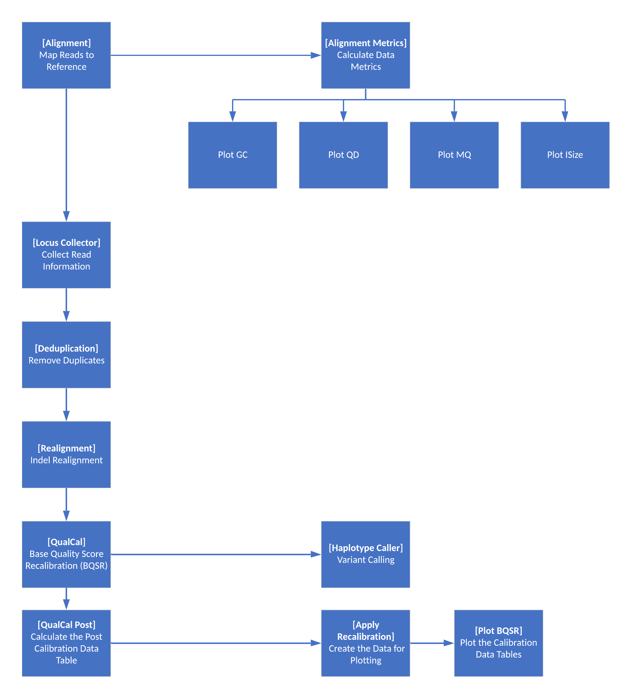
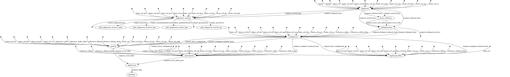
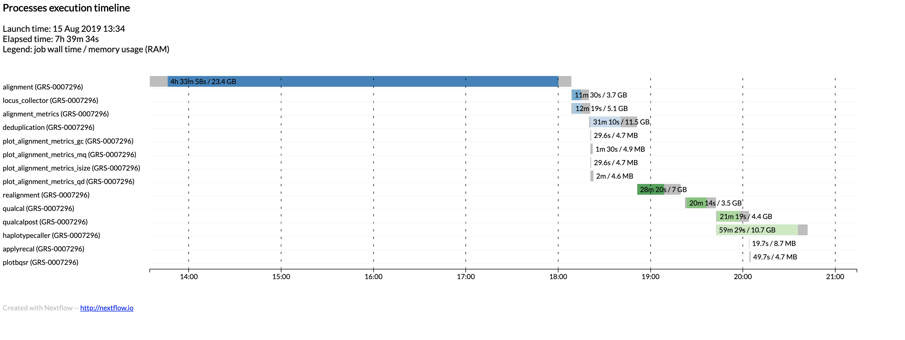
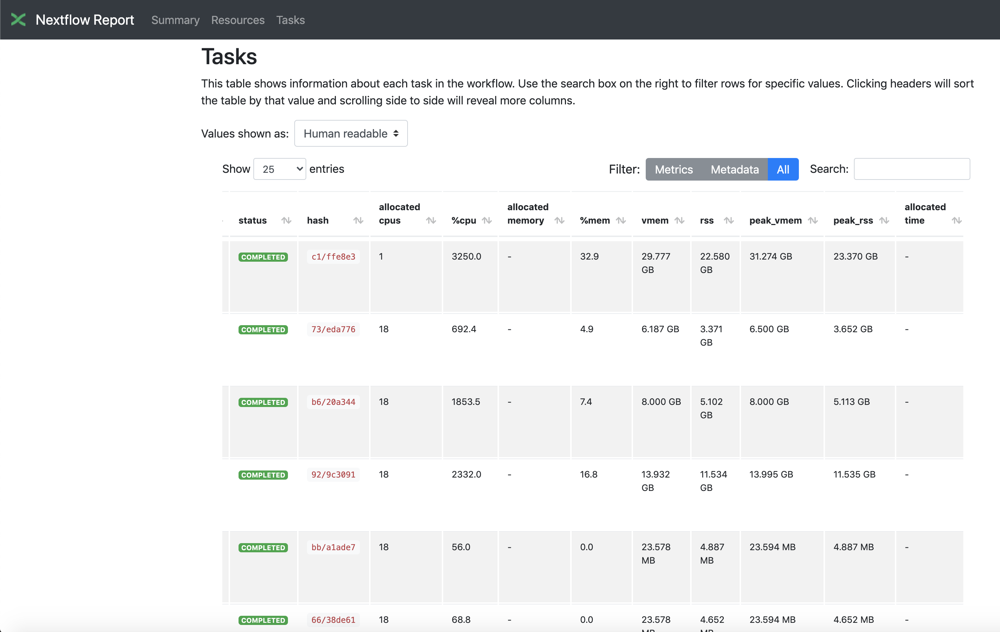

# Introduction
This project contains a nextflow-based workflow for pre-processing a WGS or WES DNA sample using the Sentieon tool set in preparation for joint genotyping.  

This project really just focuses on the workflow itself, with several assumptions built into it's design (see below for a description of these).

The project includes a shell script that can be run to execute the Nextflow process.

# Assumptions

1. The workflow will be executed using AWS Batch as the executor.
1. The FASTQ files that are input to the workflow were generated from an Illumina DNA sequencing machine.  Using a different sequencing platform will affect the expected headers in BWA MEM.
1. The sequences are from human DNA samples and are being aligned to assembly 38 of the human reference genome.
1. All input sequence files (FASTQ) and output files (BAM, gVCF, logs, etc) are stored on s3.

# Pre-requisites
The following are a list of pre-requisites that must be installed/configured that are outside the scope of this project.

1. An AWS Batch compute environment.  You will need to update the nextflow.config file with the ARN of the Batch Queue you will be using.  If you need help with configuring a Batch compute environment, queue and job definition please refer to the reference architecture provided by AWS:

   [Genomics Workflows on AWS](https://docs.opendata.aws/genomics-workflows/orchestration/nextflow/nextflow-overview/)

1. A valid Sentieon license.  The Sentieon tools are commercial software and a license is required for their download and use. Please go to www.sentieon.com/home/free-trial/ to request a license.

1. A Docker image with the Sentieon tools installed.  This image should be referenced from your AWS Batch job definition.  There are images publicly available from [DockerHub](https://hub.docker.com/r/sentieon/sentieon-aws).

1. Three s3 paths (these could all be different prefixes to a single s3 bucket, or separate s3 buckets):
   - Output directory.  This is where all final output files produced by the workflow will be written
   - Work directory.  This is where all intermediate files created during the workflow will be written.  It is recommended to have an s3 lifecycle policy on this path, as these files are not required after successful completion of the workflow.
   - Log directory.  There are several log files and diagnostic outputs written by Nextflow at the end of the workflow.  These outputs will be copied to this location by the shell script that invokes the Nextflow workflow.

# Running the Workflow

## Runtime Parameters 
There is an example shell script provided with this project that illustrates how to execute the workflow.  This script requires 9 positional arguments as follows:
1. The Sample ID.  This is an identifier of the DNA sample and will be used in naming output files and the s3 prefix where the outputs are written from the workflow.
1. The path to the FASTQ R1 file.  While Nextflow supports numerous filesystems, this workflow makes the assumption that the file is stored on s3.
1. The path to the FASTQ R2 file.  While Nextflow supports numerous filesystems, this workflow makes the assumption that the file is stored on s3.
1. The path to the location on s3 where the output files should be written.
1. The path to the location on s3 where intermediate "work" directory should be stored.  These files are transient and can be removed upon successful completion of the workflow (a lifecycle policy is recommended)
1. The path to the location on s3 where the log files should be written.  An example of the files written by Nextflow can be found below.
1. Is the sample whole exome sequencing?  This is a boolean with values "true" if a WES samples or "false" if a WGS sample.
1. The name of the AWS region where the s3 bucket(s) are located.  For example, "us-east-1".
1. The name of the job definition for use with AWS Batch.  This job definition should already be defined in your environment.

## Execution

The following is an example running the alignment workflow with a WES sample
```bash
./run_workflow.sh \
SRR077349 \
ftp://ftp.sra.ebi.ac.uk/vol1/fastq/SRR077/SRR077349/SRR077349_1.fastq.gz \
ftp://ftp.sra.ebi.ac.uk/vol1/fastq/SRR077/SRR077349/SRR077349_2.fastq.gz \
s3://sentieon-nextflow/outputs \
s3://sentieon-nextflow/workdir \
s3://sentieon-nextflow/logs \
true \
us-east-2 \
sentieon-nextflow
```

Note that the haplotype caller requires as input a bed file corresponding to the capture regions of the exome kit used during the sequencing process.
The path to this file should be updated in the nextflow.config file in this project.

If you are aligning a WGS sample using this workflow, the only change would be to set parameter 7 to "false".

## Output Files

When executed successfully this produce the following files:

```
<sample_id>.bam
<sample_id>.bam.bai

<sample_id>.g.vcf.gz
<sample_id>.g.vcf.gz.tbi

<sample_id>_flowchart.png
<sample_id>_report.html
<sample_id>_timeline.html
<sample_id>_trace.txt
```


# Workflow Overview

The following diagram illustrates the steps in the Sentieon alignment workflow


# Workflow Observations

We were using this workflow to process close to 1,000 40x WGS samples at the same time. 
During this processing window we found that we had to throttle how many samples we attempted to process at one time as we would run into numerous API limits (s3, Batch, EBS, ECR, EC2 Spot, etc).  
Our observation was that Nextflow would often silently mask s3 transfer errors and attempt to execute the process anyways.
If the transfer error occurred on an index file then the Sentieon tool will fail with an unsuccessful exit status.  
There were however instances where the step would fail but the workflow would complete with a successful status.  
To ensure that this does not happen, some of the file transfers are now done explicitly during the process execution in this workflow instead of relying on Nextflow to transfer the large input and output files.
This does remove some of the flexibility that Nextflow's abstractions provide, however ensure that the workflow completes successfully.

# Nextflow Diagnostic Outputs

Flowchart:



Timeline (this is for a WGS sample):



Trace Data:


Report:

This is a subset of the entire report, only highlighting one of several sections available


# Example Batch Job Definition

The following is an example CloudFormation script for a job definition in AWS Batch

```
AWSTemplateFormatVersion: "2010-09-09"

Description: AWS Batch job defintion for the Sentieon tools

Resources:
  SentieonDNASeq:
    Type: "AWS::Batch::JobDefinition"
    Properties:
      Type: container
      JobDefinitionName: "DNASeq-sentieon-submit-job"
      RetryStrategy:
        Attempts: 1
      ContainerProperties:
        Memory: 1000
        Vcpus: 1
        JobRoleArn: !Ref DNASEQJobRole
        Image: sentieon/sentieon-aws:201911-0
```